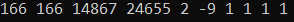
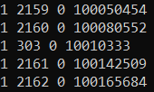

# Data

## Outline

   - *Section 3.2* lists and loads R packages used in Part 1 of this book
   - *Section 3.3* introduces and reads in all raw data files
   - *Section 3.3* provides a data dictionary and summary of each variable in each dataset
   - *Section 3.4* details the data preparation process, and presents code and procedures that turn raw data into files that are ready for analysis

## R Packages

Each time a new R session is initialized, all required packages have to be loaded using ```library``` (except the ```base```, ```stats```, and ```utils``` packages).

```{r packages}
library(AlphaSimR) # Genetic population simulation package
library(bookdown) # Compilation of book
library(dataMeta) # Data dictionaries
library(data.table) # Read in delimited files
library(Hmisc) # Miscellaneous
library(kableExtra) # Results tables
library(knitr) # RMarkdown report generation
library(lubridate) # Management of date and time variables
library(pedigree) # Calculation of generation number
library(optiSel) # Evaluation of pedigree file
library(tidyverse) # Data management, cleaning, and visualization
library(vroom) # Efficient loading of large files
```

## Files

The following 4 files were communicated from The Maschhoff's LLC by Dr. Crum:

 1. Full_Pedigree.csv (40.98 MB; R object name: **ped**)
 2. PigInformation.csv (128.33 MB; R object name: **pig_info**)
 3. genotypes.txt (6.48 GB; R object name: **genotype**)
 4. 50K_Porcine_n49991_header_20190528.map (1.32 MB; R object name: **map**)
 
Based on the size of these files, a simple workaround using an outside R script was conducted to reduce time spent loading each file.

```{r outside-script, eval=FALSE}
# readdata.r script described below (this script is not evaluated in this document)

rm(list = ls())

### Change working directory
setwd("C:/Users/cgroh/OneDrive/Desktop/PhD/Project 1 - GSM/Raw Data/")

### Read in 4 files
genotype <- fread('genotypes.txt', 
                  select = c(1), 
                  header = F, 
                  sep = "\t", 
                  colClasses = c('character'))
names(genotype)[1] <- 'PigID'

ped <- vroom("Full_Pedigree.csv", 
             col_types = 'cccc')

pig_info <- vroom("PigInformation.csv", 
                  col_types = 'cccccccc')

map <- vroom("50K_Porcine_n49991_header_20190528.map", 
             col_types = 'ccc')

### Remove pigs with IDs that begin in "G"
ped$filter <- grepl("G", ped$PigID)
ped <- ped %>% 
   filter(filter == F) %>% 
   select(PigID:BirthDate)

setwd("C:/Users/cgroh/OneDrive/Desktop/PhD/Project 1 - GSM/Intermediate Data/")

### Save as an .RData object
save(ped, pig_info, genotype, map, file = "RFiles.RData")
```

Now, each time the code in this chapter is run, R will only need to load the "RFiles.RData" object, which is much quicker than reading in each file independently.

```{r load-files}
### Clear current RStudio environment
rm(list = ls()) 
setwd('C:/Users/cgroh/OneDrive/Desktop/PhD/Project 1 - GSM/Intermediate Data')

load('RFiles.RData')

### Convert to tibble for better printing
genotype <- as_tibble(genotype)
ped <- as_tibble(ped)
pig_info <- as_tibble(pig_info)
```

## Data Dictionary

### ```ped```

The code used to present a glimpse, build the data dictionary, and describe each variable for ```ped``` is shown in the following three code chunks. In order to optimize the length of each chapter, code will only be shown if a certain procedure has not been presented before. However, the entire R script for each chapter will be available as separate files in an Appendix section.

```{r ped-glimpse}
### Glimpse of ped dataframe
head(ped)
```

The ```ped``` dataset has 4 columns. Column descriptions are below:

```{r ped-dict}
### Describe variables
variable_names <- names(ped)
variable_description <- c("Progeny identification", 
                          "Sire identification", 
                          "Dam identification", 
                          "Birth year and month (YYYYMM)")
variable_types <- c(class(ped$PigID), 
                    class(ped$SirePigID), 
                    class(ped$DamPigID), 
                    class(ped$BirthDate))

### Build dictionary
dictionary <- tibble(`Variable Names` = variable_names,
                     Description = variable_description,
                     `Variable Types` = variable_types)

### Display dictionary
kable(dictionary,
      caption = "Data dictionary for ped dataset.",
      booktabs = TRUE,
      row.names = FALSE)
```

The ```ped``` dataframe is the actual pedigree used in The Maschhoff's routine genetic evaluation. For selection mapping analyses in the current project, only pigs in this pedigree matter. A summary of each variable is presented below:

```{r ped-describe}
### Concise summary of each column
Hmisc::describe(ped)
```

From this summary, The Maschhoff's pedigree has the following attributes:

   - 1,333,508 progeny from 4183 sires and 56,522 dams
   - Lowest values for sire and dam columns is 0
      - Pigs with 0 in the sire and dam columns are founder animals
   - Birth dates range from the year 1900 to 2020
      - Pigs with a birth date of 1900 or 1951 are likely founder animals
   - There are no missing values
      - Each pig has pedigree information (other than founder animals)

### ```pig_info```

First 6 rows of the ```pig_info``` dataset:

```{r pig-info-glimpse, echo=FALSE}
### Glimpse of pig_info dataframe
head(pig_info)
```

There are 8 columns in this dataset, and they are defined below:

```{r pig-info-dict, echo=FALSE}
### Describe variables
variable_names <- names(pig_info)
variable_description <- c("Progeny identification", 
                          "Sire identification", 
                          "Dam identification", 
                          "Unique identification of each litter in which the pig was born",
                          "Genetic line, specified by The Maschhoff's",
                          "Family within genetic line, specified by The Maschhoff's",
                          "Sex of the pig",
                          "Four digit site code for the current location of the pig within The Maschhoff's")
variable_types <- c(class(pig_info$PigID), 
                    class(pig_info$SirePigID), 
                    class(pig_info$DamPigID), 
                    class(pig_info$BirthLitterID),
                    class(pig_info$Line),
                    class(pig_info$Family),
                    class(pig_info$Gender),
                    class(pig_info$CurrentSiteCode))

### Build dictionary
dictionary <- tibble(`Variable Names` = variable_names,
                     Description = variable_description,
                     `Variable Types` = variable_types)

### Display dictionary
kable(dictionary,
      caption = "Data dictionary for pig_info dataset.",
      booktabs = TRUE,
      row.names = FALSE)
```

The ```pig_info``` dataset expands upon progeny within the ```ped``` dataset by providing additional information about each pig. In subsequent sections, pigs that are in the ```pig_info``` dataset but not in the ```ped``` dataset will be filtered from ```pig_info```. A summary of each column is displayed below:

```{r pig-info-describe, echo=FALSE}
### Concise summary of each column
Hmisc::describe(pig_info)
```

Key attributes of the ```pig_info``` dataset from the summary above are highlighted below:

   - 1,914,836 progeny from 6060 sires and 74,584 dams (**Reminder:** only pigs in ```ped``` matter for this project)
   - 131 unique families within 109 unique genetic lines (**Note:** some lines do not have any family subsets; these are "Not Specified")
   - Proportions of males and females are equal (0.50)
   - 126 unique locations
   - Columns with missing data (**Note:** many of the rows that contain missing data will be filtered from this dataset, as they are unnecessary):
      - SirePigID
      - DamPigID
      - BirthLitterID
      - Gender
      - CurrentSiteCode
      

### ```genotype```

Due to the size of the genotype file (> 1 GB), manipulation and analysis of this data is extremely difficult in R, especially on a local machine (laptop). Therefore, an example of the dataframe structure of ```genotype``` will be generated. This will be separate from the ```genotype``` dataframe, which is simply a vector of Pig ID's that are genotyped.

```{r genotype-ex, echo=FALSE}
### Build a dataframe by hand
temp_genotype <- tibble(PigID = c(1, 2, 3, 4, 5),
                        Genotype = c("0,2,0,1,5",
                                     "1,1,0,5,2",
                                     "2,1,0,5,1",
                                     "2,2,2,5,1",
                                     "1,1,2,1,0"))
temp_genotype
```

This example dataset (```temp_genotype```) has 5 pigs, each with 5 SNP positions. For consistency, a data dictionary of ```temp_genotype``` is presented below:

```{r genotype-dict, echo=FALSE}
### Describe variables
variable_names <- names(temp_genotype)
variable_description <- c("Pig identification", 
                          "Genotype string")
variable_types <- c(class(temp_genotype$PigID), 
                    class(temp_genotype$Genotype))

### Build dictionary
dictionary <- tibble(`Variable Names` = variable_names,
                     Description = variable_description,
                     `Variable Types` = variable_types)

### Display dictionary
kable(dictionary,
      caption = "Data dictionary for temp_genotype dataset.",
      booktabs = TRUE,
      row.names = FALSE)
```

In this example dataset, the Genotype column is a [string](https://www.tutorialspoint.com/r/r_strings.htm) of [haplotypes](https://www.genome.gov/genetics-glossary/haplotype), with the haplotype for each SNP located between each comma. Since there are 49,991 SNPs in the real ```genotype``` dataframe, the Genotype column is 49,991 elements long. There are 4 possible haplotypes coded at each position:

   * 0 = Alleles AA
   * 1 = Alleles AB
   * 2 = Alleles BB
   * 5 = Missing genotype data
   
This SNP array is formatted for analysis in the [BLUPF90 family of programs](http://nce.ads.uga.edu/wiki/doku.php). Another common format is [PLINK](http://zzz.bwh.harvard.edu/plink/), which will be discussed in section 3.4.
   
In section 3.2, an outside R script was presented that read in the first column of the genotype file. For all subsequent analyses, this single column of Pig ID's will be considered the ```genotype``` dataframe. A glimpse of ```genotype``` is presented below.

```{r genotype-glimspe-real, echo=FALSE}
head(genotype)
```

And a description of the single variable in the dataframe, PigID:

```{r genotype-describe-real, echo=FALSE}
Hmisc::describe(genotype)
```

A quick look at the output from the ```describe``` function reveals that 66,388 total pigs from the entire pedigree have been genotyped in The Maschhoff's genetic evaluation program thus far. There are no missing values in this column, as expected.

### ```map```

One of the most important files in a genomic analysis is the MAP file, which connects each of the SNP columns in the genotype file to the actual genomic position in a certain reference genome. Coordinates in the MAP file used in this analysis are mapped to [*Sus scrofa* 10.2](http://may2017.archive.ensembl.org/Sus_scrofa/Info/Index). The first six rows of this file are shown below:

```{r map-glimpse, echo=FALSE}
### Glimpse of temp_genotype dataframe
head(map)
```

And a description of each variable is presented below:

```{r map-dict, echo=FALSE}
### Describe variables
variable_names <- names(map)
variable_description = c("Chromosome number", 
                         "SNP name or ID number",
                         "Physical base pair position")
variable_types <- c(class(map$CHR), 
                    class(map$SNP_ID),
                    class(map$POS))

### Build dictionary
dictionary <- tibble(`Variable Names` = variable_names,
                     Description = variable_description,
                     `Variable Types` = variable_types)

### Display dictionary
kable(dictionary,
      caption = "Data dictionary for map dataset.",
      booktabs = TRUE,
      row.names = FALSE)
```

These three columns provide all the necessary information to locate where each SNP in the genotype file sits across the pig genome. A summary of each variable is displayed below:

```{r map-describe, echo=FALSE}
### Concise summary of each column
Hmisc::describe(map)
```

The length of this dataset confirms that there are 49,991 SNPs in which genotypes are available for selection mapping analyses (before quality control, which is discussed later). A couple of other things to note:

   - SNPs are not spread evenly across chromosomes. Chromosome 20 only has 14 SNPs, while chromosome 1 has 4917 SNPs
   - There are no missing values
   - The number of distinct POS values does not match the number of observations. These are not the only SNP identifiers (there are two other columns of information), so it likely will not affect the analysis 

```{r rm-1, echo=FALSE}
rm(dictionary, temp_genotype, variable_description, variable_names, variable_types)
```

## Data Preparation

Data preparation is a necessary task that takes on an infinitely many forms, depending on the goals of a project. Throughout this book, I am going to attempt to use a consistent system for getting data ready to be explored, mined, and modeled. However, some recurring terms will need to be defined before I begin.

### Three Types of Data

 - **Raw Data:** data that has never been manipulated; this data always needs to be stored in its original form, and the original file can *NEVER* be modified
 - **Tidy Raw Data** raw data that has been modified to conform to Hadley Wickham's definition of "tidy data": 1) each row is an observation, 2) each column is a variable, and 3) each type of observational unit forms a table. Sometimes raw data and tidy raw data are the same, depending on the cleanliness of the raw data
 - **Intermediate Data:** tidy raw data that has had anomalies and unnecessary observations and variables removed and additional variables calculated that are required in the analysis *OR* any new file or dataset that is created from tidy raw data; when data reaches the end of this stage, it is generally ready to be analyzed

### Process Overview

Below is an outline of the data preparation process for each file:

**ped**

   1. Raw Data to Tidy Raw Data
      i. This file was communicated in tidy format
      ii. Convert column types to correct class
   2. Tidy Raw Data to Intermediate Data
      i. Transfer BirthDate to ```pig_info```
      ii. Synch PigID, SirePigID, and DamPigID with ```pig_info```

**pig_info**

   1. Raw Data to Tidy Raw Data
      i. This file was communicated in tidy format
      ii. Convert column types to correct class
      iii. R object name changed to ```ped_plus``` (```ped``` plus pig information)
   2. Tidy Raw Data to Intermediate Data
      i. Remove pigs with a breed discrepancy (sire and dam breeds do not produce correct progeny breed combination)
      ii. Remove unnecessary observations based on column Line
      iii. Remove unnecessary observations based on CurrentSiteCode
      iv. Create variables for birth date (from ```ped```), age, generation number, and whether or not a pig was genotyped (from ```genotype```)
      
**genotype**

   1. Raw Data to Tidy Raw Data
      i. This file was communicated in BLUPF90 format, and the first column of pig ID's were loaded into R in tidy format
      ii. Convert column type to correct class
   2. Tidy Raw Data to Intermediate Data
      i. Create a column where each value is "TRUE" (for filtering purposes in ```ped_plus```)
      
   **Note:** data preparation using ```genotype``` will be included in the section for the pedigree files

**map**

   1. Raw Data to Tidy Raw Data
      i. This file was communicated in tidy format
      ii. Convert column types to correct class
   2. Tidy Raw Data to Intermediate Data
      i. Reconcile "bad" entries in the POS column
      
**genotypes.txt**

Data preparation procedures were not limited to R in this section. Python and a combination of linux command line functions were used for handling the genotype files for each subgroup (given their size). PLINK was used to apply genotype quality control filters.

   1. Raw Data to Tidy Data
      i. Create subgroups based on subsequent analyses
      ii. Convert genotype file for each subgroup to PLINK format
   2. Tidy Raw Data to Intermediate Data
      i. Perform genotype filtering for quality control on each subgroup
      ii. Convert to [BIM, BED, and FAM file formats](http://zzz.bwh.harvard.edu/plink/data.shtml#bed) for each subgroup
      
**Additional Intermediate Data**

   1. [Genomic relationship matrices](http://nce.ads.uga.edu/wiki/lib/exe/fetch.php?media=uga_3_relationship.pdf) (**GRMs**) for each subset post-quality control using **G**enome-wide **C**omplex **T**rait **A**nalysis (**GCTA**)
   2. Phenotype files for each subgroup using R
      
### Pedigree Files (```ped``` and ```pig_info```)

#### Filter by Genetic Line

The first step of the data preparation will be ensuring each variable in ```ped``` and ```pig_info``` are of the correct class. If we refer to the previous section, we can see the class of each column for these datasets in their respective data dictionaries is character. Whenever values are unknown in certain columns of raw data, it is best to read them in as type character, in order to preserve all values in the column. If we would attempt to read in a column as integers and some values in the column contain letters, those values will be removed. Nevertheless, all pig ID's (progeny, sire, and dam) need to be integers, while all other columns need to be characters:

```{r ped-tidy}
ped_tidy <- ped %>%
   mutate_at(c(1:3), as.integer)

pig_info_tidy <- pig_info %>%
   mutate_at(c(1:3), as.integer)
```

The "_tidy" extensions was appended to ```ped``` and ```pig_info```, which signifies they have passed all data quality checks required to be considered tidy data.

In the objectives of Chapter 2, it was stated that selection mapping analyses were going to be conducted for 4 genetic lines. The current ```ped``` and ```pig_info``` datasets, however, contain information on over 100 genetic lines. To get from the current state of the datasets to a point where they are ready for analysis, there are various data carpentry procedures that are required, such as row filtering, column selection, and variable calculation. There are 3 pure breeds that within these pedigree records, and they are as follows:

   1. [Duroc](http://afs.okstate.edu/breeds/swine/duroc/index.html/) (The Maschhoff's Line 1006)
   2. [Landrace](http://afs.okstate.edu/breeds/swine/americanlandrace/index.html) (The Maschhoff's Line 10 or 1005)
   3. [Yorkshire](http://afs.okstate.edu/breeds/swine/yorkshire/index.html) (The Maschhoff's Line 11)

Then, there are records on crossbred pigs:

   4. Crossbred [Duroc $\times$ (Landrace $\times$ Yorkshire)] (The Maschhoff's Line 9006)

Why these 4 lines? 

   - Landrace, Yorkshire, and Duroc pigs are the backbone of the United States swine industry
   - By far, pigs from these genetic backgrounds outnumber others in the genotype file
   - Selection objectives are clear, defined by selection indices
   
Pedigree records in the ```pig_info_tidy``` dataset do not have breed assignments (only genetic lines). Below, breeds are assigned to each purebred pig.

```{r assign-breed}
### Merge to sync pedigree information and add birth date 
ped_plus_tidy <- left_join(ped_tidy, pig_info_tidy, by="PigID") %>% 
   dplyr::mutate(SirePigID.x = SirePigID.y,
                 DamPigID.x = DamPigID.y,
                 PigBreed = ifelse(Line == 10 | Line == 1005, 'L',
                                   ifelse(Line == 11, 'Y',
                                          ifelse(Line == 1006, 'D', NA)))) %>%
   rename(SirePigID = SirePigID.x,
          DamPigID = DamPigID.x) %>%
   select(PigID:BirthDate, PigBreed, Line:Gender, BirthLitterID, CurrentSiteCode)

### Deleted
rm(pig_info_tidy) 
```

The ```ped_tidy``` and ```ped_plus_tidy``` datasets contain 1,333,508 pigs. The name of ```pig_info_tidy``` was changed for clarity; because only pigs in the ```ped_tidy``` dataframe are going to be included in subsequent analyses, the ```pig_info_tidy``` dataframe was appended to ```ped_tidy```, which made ```ped_plus_tidy``` (a dataframe of pedigree information plus pig information). Because there are over 1 million pigs (more chances for error), discrepancies between progeny genetic line and the genetic line combinations of the parents were checked and removed.

```{r discrep-check}
### Merge to create a column for breed of sire
ped_plus_tidy <- merge(ped_plus_tidy, 
                       ped_plus_tidy[,c(1,5)], 
                  by.x='SirePigID', 
                  by.y = 'PigID', 
                  all.x = TRUE) %>% 
   arrange(PigID) %>% 
   dplyr::rename(PigBreed = PigBreed.x, 
                 SireBreed = PigBreed.y)

### Merge to create a column for breed of dam
ped_plus_tidy <- merge(ped_plus_tidy, 
                       ped_plus_tidy[,c(2,5)], 
                  by.x='DamPigID', 
                  by.y = 'PigID', 
                  all.x = TRUE) %>% 
   arrange(PigID) %>% 
   dplyr::rename(PigBreed = PigBreed.x,
                 DamBreed = PigBreed.y)

### Remove any rows where breed of sire and dam are not valid for breed of offspring
ped_plus_tidy <- ped_plus_tidy %>%
   dplyr::mutate(filter1 = ifelse(is.na(PigBreed) == FALSE,
                                  ifelse(PigBreed == SireBreed & PigBreed == DamBreed, FALSE, TRUE), FALSE)) %>%
   filter(filter1 == FALSE | is.na(filter1) == TRUE) %>%
   select(PigID, SirePigID, DamPigID, PigBreed, SireBreed, DamBreed,
          Line, Family, BirthDate, Gender, BirthLitterID, CurrentSiteCode)
```

Eighty-six pigs (0.006% of the entire pedigree) had breed discrepancies and were removed, leaving 1,333,422 pigs in each dataset. However, there are only genotype records for 4 genetic lines [Duroc, Landrace (The Maschhoff's Line 10), Yorkshire, and Crossbred]. Thus, any pig that is not of these genetic backgrounds can be removed using the ```dplyr``` function of the ```tidyverse``` [family of packages](https://www.tidyverse.org/).

```{r filter-lines}
### Remove unnecessary breeds
ped_plus_tidy <- ped_plus_tidy %>%
   filter(Line %in% c('10', '11', '1006', '9006'))
```

After the genetic line filter was applied, 1,267,652 pigs remain in the ```ped_plus_tidy``` dataset, and below is the current structure of ```ped_plus_tidy```:

```{r ped-plus-v2-head, echo=FALSE}
head(ped_plus_tidy)
```

#### Additional Variables

In the previous section, all rows were filtered from ```ped_tidy``` and ```ped_plus_tidy``` that were not needed for the selection mapping analyses. However, there are a few additional columns that need to be created or calculated, namely generation and age. Each pig has a birth date, however it is in a unconventional format (YYYYMM) when it needs to be an actual calendar date (YYYY-MM-DD) for age calculation and time series plotting.

```{r date}
### Make a month and year column from BirthDate
ped_plus_tidy <- ped_plus_tidy %>% extract(BirthDate, 
                                           into = c("Year", "Month"), "(.{4})(.{2})", 
                                           remove = F) %>%
### Set birth day to the first of the month
                         dplyr::mutate(Day = '01') %>% 
### Change BirthDate to variable type Date
                         dplyr::mutate(BirthDate = ymd(paste(Year,'-',Month,'-',Day, sep = ""))) %>%
                         select(PigID:Year, Gender:CurrentSiteCode) %>%
                         rename(Sex = Gender)
```

Now, pedigree age can be calculated. Pedigree age (**AGE**) is defined as the difference between each pig's birth month and January 2006. The selection of January 2006 as the reference date is arbitrary; however, in this population, the number of pedigree records began to increase steadily around this date (this will be discussed later).

```{r age}
ped_plus_tidy <- ped_plus_tidy %>% 
   dplyr::mutate(Age = interval(ymd(20060101), BirthDate) %/% months(1))
```

The next variable to be calculated is generation number, which can be accomplished using the ```pedigree``` package. However, the pedigree needs to be sorted first.

```{r gen-number}
### Order pedigree - parents before offspring
ord <- orderPed(ped_plus_tidy[,1:3])
ped_plus_tidy <- ped_plus_tidy[order(ord),]

### Calculate and assign generation number
gen <- countGen(ped_plus_tidy[,1:3])
ped_plus_tidy$Generation <- gen

### Append generation number to ped_plus_tidy dataframe, remove excess columns, and reorder
ped_plus_tidy <- left_join(ped_plus_tidy, ped_tidy[,1:3], by="PigID") %>%
   dplyr::mutate(SirePigID.x = SirePigID.y,
                 DamPigID.x = DamPigID.y) %>%
   rename(SirePigID = SirePigID.x,
          DamPigID = DamPigID.x) %>%
   select(PigID:Generation)

### Synchronize pedigree files
ped_tidy <- ped_plus_tidy[,1:3] 

### Deleted
rm(gen, ord) 
```

The last variable that needs to be created is a column that specifies whether or not a pig was genotyped.

```{r genotyped}
### Create a column of TRUEs for filtering
genotype_tidy <- genotype %>%
   mutate(PigID = as.integer(PigID),
          Genotyped = TRUE)

### Join ped_plus_tidy and genotype dataframes and reorder
ped_plus_tidy <- left_join(ped_plus_tidy, genotype_tidy, by="PigID") %>%
   mutate(Genotyped = ifelse(is.na(Genotyped) == TRUE, FALSE, TRUE)) %>%
   select(PigID:CurrentSiteCode, Genotyped, Age:Generation)

### Glimpse of new variables
head(ped_plus_tidy[,c(1:3, 9:10, 13:15)]) 
```

#### Filter by Current Location

In early discussions of the project, The Maschhoff's specified that pigs from a recent purchase of outside genetics should be removed from all analyses as selection in these animals was different than the majority of the pigs in the pedigree. Pigs with a CurrentSiteCode of "WHHS" or "WHSS" were removed.Why weren't these observations removed when genetic lines were filtered? They probably could have been, but in case any of the WHHS or WHSS animals were ancestors of pigs from other sites, their pedigree information was incorporated in the calculation of generation number. In the grand scheme of the analysis, this order likely doesn't make a huge difference.

```{r site-code-filter}
### Remove WHHS and WHSS
ped_plus_intmd <- ped_plus_tidy %>%
   filter(!CurrentSiteCode %in% c('WHHS', 'WHSS'))

ped_intmd <- ped_plus_intmd[,1:3]
```

The "_intmd" extension replaced "_tidy" in both ```ped_tidy``` and ```ped_plus_tidy```, which signifies that these datasets have reached the intermediate stage and are ready for use in the selection mapping analysis, tables, and figures.

### MAP File

MAP files in genomic analyses are files (usually single-space separated text files) that "map" each SNP in the genotype file or SNP array to its physical position in a pig's genome. For this selection mapping analysis, [*Sus scrofa* 10.2](http://may2017.archive.ensembl.org/Sus_scrofa/Info/Index) is the reference genome in which each SNP is mapped. The MAP file used in the selection mapping analyses will need to be in a certain format. The first program the MAP file will be run through is PreGSF90 of the [BLUPF90 family of programs](http://nce.ads.uga.edu/wiki/doku.php). According to Aguilar and Misztal (2014; [PreGSF90/PostGSF90 README](http://nce.ads.uga.edu/wiki/doku.php?id=readme.pregsf90)), the SNP map file should have a header with the following column names, in order:

  1. SNP_ID - identification of the SNP (alphanumeric)
  2. CHR - chromosome number (numeric), starting from 1
  3. POS - position bp (numeric)
  
Thus, minor changes to the 50K_Porcine_n49991_header_20190528.map (provided by Dr. Crum on 9/4/20) are required. 

```{r map-1} 
### Add permanent row index to avoid row permutation
map <- map %>% 
   dplyr::mutate(id = row_number()) 
head(map)
```

First, we notice that the order of the columns is incorrect for PreGSF90. In addition, the POS column was read in as "character", and it should be integer. This means that at least 1 value is not in numeric or integer form.

```{r map-2, message=TRUE, warning=TRUE}
map_tidy <- map[,c(4,2,1,3)] %>% 
   dplyr::mutate(POS = as.integer(POS))

### Still considered "tidy"; All requirements are met at this point
```

The error messages tell us that by running ```as.integer``` on the POS column of ```map```, NA values were introduced. This means that there are some values in the POS column that are non-numeric. These will now be "NA" in ```map_tidy```, as R does not know how to render an integer from a value that contains letters or special characters.

```{r map-3}
### Create filter for rows with NA values in POS column
map_tidy <- map_tidy %>% 
   dplyr::mutate(filter1 = is.na(POS))

### Filter rows from above
error_rows <- map_tidy %>% 
   filter(filter1 == T) %>% 
   select(-POS, -filter1)

### Join with original MAP file
error_rows <- left_join(error_rows, map[,c(3,4)], by="id") 
head(error_rows)
```

The source of the error in the POS column is clear. Instead of single integers, genomic positions of these error SNPs are specified as ranges. The following code chunk will address these errors.

```{r map-4}
### Separate the first and last number of range into own column
error_rows <- error_rows %>% 
   separate(col = POS, into = c("POS1", "POS2"), sep = "-") %>% 
   select(-POS2) %>%
   dplyr::mutate(POS1 = as.integer(POS1)*-1)

### Make changes to MAP file
map_intmd <- left_join(map_tidy[,1:4], error_rows[,c(1,4)], by="id") %>%
   arrange(id) %>%
   dplyr::mutate(POS = ifelse(is.na(POS) == T, POS1, POS)) %>%
   select(-id, -POS1)

head(map_intmd)
```

Above, the error in the POS column was fixed by changing the range of genomic positions to a single negative integer that corresponded to the first value in the range of genomic positions $\times$ -1. This affected only 19 out of 49,991 SNP positions (0.04%). A space-separated text version of ```map_intmd``` MAP file will be used in all subsequent selection mapping analyses.

```{r save-map-ped-plus, echo=FALSE}
setwd('C:/Users/cgroh/OneDrive/Desktop/PhD/Project 1 - GSM/Intermediate Data')

### ped_intmd.txt
fwrite(ped_intmd,
       file = "ped_intmd.txt",
       sep = " ",
       row.names = FALSE,
       col.names = FALSE,
       na = "NA",
       quote = FALSE)

### ped_intmd.csv w/ headers
fwrite(ped_intmd,
       file = "ped_intmd.csv",
       sep = ",",
       row.names = FALSE,
       col.names = TRUE,
       na = "NA",
       quote = FALSE)

### ped_plus_intmd.txt
fwrite(ped_plus_intmd,
       file = "ped_plus_intmd.txt",
       sep = " ",
       row.names = FALSE,
       col.names = FALSE,
       na = "NA",
       quote = TRUE)

### ped_plus_intmd.csv w/ headers
fwrite(ped_plus_intmd,
       file = "ped_plus_intmd.csv",
       sep = ",",
       row.names = FALSE,
       col.names = TRUE,
       na = "NA",
       quote = FALSE)

### map_intmd.txt
fwrite(map_intmd,
       file = "map_intmd.txt",
       sep = " ",
       row.names = FALSE,
       col.names = TRUE,
       na = "NA",
       quote = FALSE)

rm(error_rows, genotype, genotype_tidy, map, map_tidy, ped, ped_tidy, ped_plus_tidy, pig_info)
```

### Genotype File

The next portion of this section will be centered around preparing the genotype files for the selection mapping analyses. From this point on, all data preparation and carpentry was performed on a server hosted at the Animal Science Research Center on The University of Missouri campus. Due to the size of the genotype files, increased computing power was required (at least more than what my local machine can handle). The name and operating system of the server is MUG06 and [CentOS 6.7](https://www.centos.org/), respectively. As mentioned in Section 3.5.2, a multitude of programs will be used on MUG06. Scripts utilized in this process can be extremely long and rather detailed; thus, examples of each script will be shown in this section and the entire scripts will be shown in the Appendix.

#### Subgroups

Up to 3 different analyses will be run as a part of the greater selection mapping project:

   1. Univariate Variance Component Estimation
   2. Bivariate Variance Component Estimation
   3. Genome-wide Association Analyses
   
At this point, I am not going to discuss the nature of these analyses any further (that will be the subject of Chapter 4). Different subgroups of pigs will be required for different analyses (and some subgroups may have multiple types of analyses run on them). These subgroups are defined in the table below:

```{r subgroups, echo=FALSE}
tibble(Subgroup = c(1:12),
       `Genetic lines` = c("Crossbred", "Duroc", "Landrace", "Yorkshire",
                           "Crossbred, Duroc", "Crossbred, Landrace", "Crossbred, Yorkshire",
                           "Duroc, Landrace", "Duroc, Yorkshire", "Landrace, Yorkshire",
                           "Duroc, Landrace, Yorkshire", "Crossbred, Duroc, Landrace, Yorkshire")) %>%
   kable(.,
         row.names = FALSE,
         align = 'c',
         caption = "Description of subgroups.")
```

After the genotype file was copied to MUG06 using [FileZilla](https://filezilla-project.org/), a [Python](https://www.python.org/) script was invoked to separate the genotype file into the subgroups in the above table. An example of that script is shown below for subgroup 1, and the entire script and log is documented in \@ref(createsubgroups):

```{python create-subsets-ex, eval=FALSE}
# /data/cjgwx7/tml_gpsm/scripts/python/CreateSubgroups.py

import pandas as pd

### Specify paths to necessary files for import
path_genotypes = "../../raw_data/level1/genotypes.txt"
path_ped_plus_intmd = "../../intmd/pedigree_map/ped_plus_intmd.txt"

### Specify paths for file export
path_s1 = "../../raw_data/level2/c.txt"

### Specify column names for input files
colnames_genotypes = ['PigID', 'SNPs']
colnames_ped_plus_intmd = ['PigID', 'Line']

### Read in genotype file and replace commas between SNP haplotypes
genotypes = pd.read_csv(path_genotypes, 
			sep = "\t", 
			names = colnames_genotypes, 
			header = None)

genotypes = genotypes.replace(',',
			      '', 
			      regex=True)

### Read in ped_plus_intmd
ped_plus_intmd = pd.read_csv(path_ped_plus_intmd, 
			     sep = " ", 
			     names = colnames_ped_plus_intmd, 
			     header = None, 
			     usecols = [0, 6])

print("Data Imported Successfully")

### Merge genotype and ped_plus_intmd to connect PigID to Line information
genotypes_plus = pd.merge(genotypes, 
	      		  ped_plus_intmd, 
	       		  how = 'left', 
	       		  on = 'PigID')
genotypes_plus = genotypes_plus[['PigID', 'Line']]
genotypes_plus = genotypes_plus.dropna()

### Create subgroups

## Crossbred
c = genotypes_plus[genotypes_plus.Line == 9006]

## Crossbred, Duroc, Landrace, and Yorkshire
cdly = genotypes_plus
cdly['f'] = cdly.Line.isin([9006, 1006, 10, 11])
cdly = cdly[cdly.f == True]
cdly = cdly.drop(columns=['f'])

print("Subgroups Created Successfully")

### Merge subgroup IDs with genotypes
c = pd.merge(c['PigID'], genotypes, how='left', on='PigID')
cdly = pd.merge(cdly['PigID'], genotypes, how='left', on='PigID')

print("Genotype File Merged Successfully")

### Check file length (Number of pigs before quality control)
print("The length of Subset 1 is:", len(c))
print("The length of Subgroup 12 is:", len(cdly))

print("Starting output of subgroup files")

c.to_csv(path_s1, sep = "\t", index = False, header = False)
cdly.to_csv(path_s12, sep = "\t", index = False, header = False)

print("Genotype files for each subgroup successfully written")
```

#### BLUPF90 to PLINK

[RENUMF90](http://nce.ads.uga.edu/wiki/doku.php?id=readme.renumf90) will be the next program that each subgroup file will be run through in order to prepare them for PREGSF90, which will save the files in [PLINK format (MAP and PED)](https://zzz.bwh.harvard.edu/plink/data.shtml). Before I go any further, I need to explain PLINK PED and MAP files and their format [mainly how it is different than BLUPF90 (\@ref(genotype))]. A PED file contains information about each subject (in our case, each pig) and all of their genotypes. Columns in this file are as shown below:

  1. Family ID (generally the same as individual ID in animals)
  2. Individual ID
  3. Paternal ID
  4. Maternal ID
  5. Sex (1 = male; 2 = female; other = unknown)
  6. Phenotype (quantitative; -9 = missing)
  7. Allele 1 for SNP 1
  8. Allele 2 for SNP 1
  9. Columns 7 and 8 are repeated for each SNP
  
The below table presents differences between PLINK PED and BLUPF90 genotypes:

```{r blupf90-plink, echo=FALSE}
tibble(BLUPF90 = c(0, 1, 2, 5),
       PLINK = c("1 1", "1 2", "2 2", "0 0"),
       Haplotype = c("AA", "AB", "BB", "missing")) %>%
  kable(.,
         row.names = FALSE,
         align = 'c',
         caption = "BLUPF90 vs PLINK haplotype format.")
```

And lastly a screenshot of an example PED file:



A PLINK MAP file is similar to a BLUPF90 MAP file, with a couple minor differences. Columns in a PLINK MAP file are described below:

  1. Chromosome number
  2. SNP ID
  3. Genetic distance (usually 0 in our case)
  4. Base-pair position

The only major differences between PLINK MAP and BLUPF90 MAP files are the addition of the genetic distance column and the order of the columns. However, the genetic distance column is usually always set to zero in our analyses, as we do not need the column.



Now that we have the differences between PLINK and BLUPF90 genotype and map files sorted, we can get back to the preparation of the genotype data. There is a limit on the number of genotyped animals that can be input into a BLUPF90 program. Thus, each of the subgroup files that are greater than 25,000 will have to be split into smaller batches (everything but subgroups 1 through 4). The following [bash](https://en.wikipedia.org/wiki/Bash_(Unix_shell)) script, \@ref(batch), will accomplish this and all subgroup and batch files will be output as [fixed-width](https://www.softinterface.com/Convert-XLS/Features/Fixed-Width-Text-File-Definition.htm) for BLUPF90 to properly read them:

```{bash batch-ex, eval=FALSE}
# /data/cjgwx7/tml_gpsm/scripts/bash/batch.sh

### Create fixed-width BLUPF90 genotype file for each subgroup
awk -F ' ' '{printf "%-15s%-50000s\n",$1,$2}' ../../raw_data/level2/c.txt > ../../raw_data/level2/c.txt_fw
awk -F ' ' '{printf "%-15s%-50000s\n",$1,$2}' ../../raw_data/level2/cdly.txt > ../../raw_data/level2/cdly.txt_fw

### Delete old .txt files
rm ../../raw_data/level2/*.txt

### Split files into batches of < 25,000 observations each
### Subgroup 1
cp ../../raw_data/level2/c.txt_fw ../../raw_data/level3/c/c.aa

### Subgroup 12
split --verbose ../../raw_data/level2/cdly.txt_fw -l21015 cdly.
mv cdly* ../../raw_data/level3/cdly/
```

Now, all batch files within each subgroup are in a fixed-width column format and have less than 25,000 observations each. Thus, we are now ready to build the parameter files for renumf90. Each batch file within each sbgroup will be run through renumf90 separately. An example of a renumf90 parameter file (essentially the file that is input into the program), for batch "aa" in subgroup 1 (Crossbred pigs) is presented below:

```{}
DATAFILE
ped_plus_intmd.txt
TRAITS
14
FIELDS_PASSED TO OUTPUT
1
WEIGHT(S)

RESIDUAL_VARIANCE
2.0
EFFECT           # 1st effect: animal
1 cross alpha
RANDOM           ## treated as a random effect
animal
FILE
ped_intmd.txt
FILE_POS
1 2 3 0 0
SNP_FILE         ## SNP marker file
c.aa
(CO)VARIANCES    ## its variance component
0.5
OPTION map_file map_intmd.txt
OPTION savePLINK
OPTION no_quality_control
```

The parameter files for each batch will be incorporated in the following bash script (\@ref(renum); only an example is shown below), named "renum.sh":

```{bash renum-ex, eval=FALSE}
# /data/cjgwx7/tml_gpsm/scripts/bash/renum.sh

### Subgroup 1 
### Copy necessary files into current directory
cp ../../intmd/pedigree_map/{ped_plus_intmd.txt,ped_intmd.txt,map_intmd.txt} .

### Copy genotype file into current directory
cp ../../raw_data/level3/c/c.aa .

### Run renumF90
renumf90 ../blupf90/renum.c_aa

### Save PLINK PED and MAP files
preGSf90 renf90.par

### Move important files to new location
mv renf90.dat toPlink.map toPlink.ped renadd01.ped c.aa_XrefID sum2pq freqdata.count Gen_call_rate ../../raw_data/level4/c/

### Remove unnecessary files
rm c.aa renf90.tables renf90.fields renf90.par

### Repeat above for each subgroup/batch combination

### Subgroup 12
cp ../../raw_data/level3/cdly/cdly.aa .
renumf90 ../blupf90/renum.cdly_aa
preGSf90 renf90.par
mv renf90.dat toPlink.map toPlink.ped renadd01.ped cdly.aa_XrefID sum2pq freqdata.count Gen_call_rate ../../raw_data/level4/cdly/aa/
rm cdly.aa renf90.tables renf90.fields renf90.par

cp ../../raw_data/level3/cdly/cdly.ab .
renumf90 ../blupf90/renum.cdly_ab
preGSf90 renf90.par
mv renf90.dat toPlink.map toPlink.ped renadd01.ped cdly.ab_XrefID sum2pq freqdata.count Gen_call_rate ../../raw_data/level4/cdly/ab/
rm cdly.ab renf90.tables renf90.fields renf90.par

cp ../../raw_data/level3/cdly/cdly.ac .
renumf90 ../blupf90/renum.cdly_ac
preGSf90 renf90.par
mv renf90.dat toPlink.map toPlink.ped renadd01.ped cdly.ac_XrefID sum2pq freqdata.count Gen_call_rate ../../raw_data/level4/cdly/ac/
rm cdly.ac renf90.tables renf90.fields renf90.par

### Remove unnecessary files
rm ped_plus_intmd.txt ped_intmd.txt map_intmd.txt
```

The script above is accomplishing numerous tasks, listed below:

  1. Copy ped_plus_intmd.txt, ped_intmd.txt, and map_intmd.txt files into the current directory (where the renum.sh script is stored and will be run)
  2. Copy genotype file into the current directory
  3. Run RENUMF90
  4. Run PREGSF90, using the renf90.par file generated by RENUMF90
  5. Move necessary output from PREGSF90 (PLINK files and renumbered pedigree and data files) to the correct subgroup and batch directory in the raw_data folder
  6. Remove unnecessary output files
  7. Remove files copied in step 1 from the script directory
  
The main file of interest generated from renum.sh is the toPlink.ped file for each batch within subgroup. This is a PED file, as described above. However, there are three issues with these files:

  1. Animal, sire, and dam IDs were renumbered through RENUMF90
  2. Sex is incomplete
  3. An extra blank column was added between the first 6 columns and the genotype data
  
The following script will fix these errors, along with row-binding each batch file into a single PED file for each subgroup:

```{bash processplinkf90-ex, eval=FALSE}
# /data/cjgwx7/tml_gpsm/scripts/bash/ProcessPlinkF90.sh

### Subgroup 1
### Remove extra blank column
cut -d ' ' -f 1-6,8- ../../raw_data/level4/c/toPlink.ped > ../../raw_data/level4/c/toPlink_v2.ped

### Extract genotypes
cut -d ' ' -f 7- ../../raw_data/level4/c/toPlink_v2.ped > ../../raw_data/level4/c/toPlink_geno.ped

### Replace renumbered IDs with actual IDs
Rscript ../r/ProcessPlinkF90/c_aa.R

### Column bind columns 1-6 and the genotypes
paste -d ' ' ../../raw_data/level4/c/c_aa.fam ../../raw_data/level4/c/toPlink_geno.ped > ../../raw_data/level6/c.ped

### Subgroup 12
### Batch 1
cut -d ' ' -f 1-6,8- ../../raw_data/level4/cdly/aa/toPlink.ped > ../../raw_data/level4/cdly/aa/toPlink_v2.ped
cut -d ' ' -f 7- ../../raw_data/level4/cdly/aa/toPlink_v2.ped > ../../raw_data/level4/cdly/aa/toPlink_geno.ped

Rscript ../r/ProcessPlinkF90/cdly_aa.R

paste -d ' ' ../../raw_data/level4/cdly/aa/cdly_aa.fam ../../raw_data/level4/cdly/aa/toPlink_geno.ped > ../../raw_data/level5/cdly/cdly_aa.ped

### Batch 2
cut -d ' ' -f 1-6,8- ../../raw_data/level4/cdly/ab/toPlink.ped > ../../raw_data/level4/cdly/ab/toPlink_v2.ped
cut -d ' ' -f 7- ../../raw_data/level4/cdly/ab/toPlink_v2.ped > ../../raw_data/level4/cdly/ab/toPlink_geno.ped

Rscript ../r/ProcessPlinkF90/cdly_ab.R

paste -d ' ' ../../raw_data/level4/cdly/ab/cdly_ab.fam ../../raw_data/level4/cdly/ab/toPlink_geno.ped > ../../raw_data/level5/cdly/cdly_ab.ped

### Batch 3
cut -d ' ' -f 1-6,8- ../../raw_data/level4/cdly/ac/toPlink.ped > ../../raw_data/level4/cdly/ac/toPlink_v2.ped
cut -d ' ' -f 7- ../../raw_data/level4/cdly/ac/toPlink_v2.ped > ../../raw_data/level4/cdly/ac/toPlink_geno.ped

Rscript ../r/ProcessPlinkF90/cdly_ac.R

paste -d ' ' ../../raw_data/level4/cdly/ac/cdly_ac.fam ../../raw_data/level4/cdly/ac/toPlink_geno.ped > ../../raw_data/level5/cdly/cdly_ac.ped

### Row bind each batch file
cat ../../raw_data/level5/cdly/cdly_aa.ped ../../raw_data/level5/cdly/cdly_ab.ped ../../raw_data/level5/cdly/cdly_ac.ped > ../../raw_data/level6/cdly.ped
```

Within the above script, R scripts (Ex: c_aa.R) are utilized to convert renumbered IDs (from BLUPF90) back to the actual pig IDs. An example of this script, for subgroup 1, is shown below:

```{r actual-ids, eval=FALSE}
library(data.table)
library(dplyr)

rm(list=ls())

path_ped_plus_intmd <- '../../intmd/pedigree_map/ped_plus_intmd.csv'
path_fam <- '../../raw_data/level4/c/toPlink.ped' # CHANGE
path_renped <- '../../raw_data/level4/c/renadd01.ped' # CHANGE
path_out <- '../../raw_data/level4/c/c_aa.fam' # CHANGE

ped_plus_intmd <- fread(path_ped_plus_intmd,
		            header = T,
		            sep = ",",
		            select = c("PigID", "Sex"))

fam <- fread(path_fam,
             header = F,
             sep = " ",
             col.names = c('FamID', 'PigID', 'SirePigID', 'DamPigID', 'Sex', 'Phenotype'),
             select = c(1:6)) %>%
  tibble::rowid_to_column("index")

renped <- fread(path_renped,
             header=F,
             sep = " ",
             select = c(1,10),
             col.names = c('RenID', 'PigID'))

fam_v2 <- merge(fam, renped,
                  by.x = "PigID", by.y = "RenID",
                  all.x = TRUE) %>%
  select(-PigID) %>%
  dplyr::rename(PigID = PigID.y)

fam_v3 <- merge(fam_v2, renped,
                  by.x = "SirePigID", by.y = "RenID",
                  all.x = TRUE) %>%
  select(-SirePigID) %>%
  dplyr::rename(PigID = PigID.x,
                SirePigID = PigID.y)

fam_v4 <- merge(fam_v3, renped,
                by.x = "DamPigID", by.y = "RenID",
                all.x = TRUE) %>%
  select(-DamPigID) %>%
  dplyr::rename(PigID = PigID.x,
                DamPigID = PigID.y)

fam_v4 <- fam_v4[,c(2, 5:7, 3:4, 1)]

fam_v5 <- left_join(fam_v4, ped_plus_intmd, by="PigID") %>%
  mutate(Sex.x = ifelse(Sex.y == "Male", 1, ifelse(Sex.y == "Female", 2, 0)),
         FamID = PigID,
         SirePigID = ifelse(is.na(SirePigID) == T, 0, SirePigID),
         DamPigID = ifelse(is.na(DamPigID) == T, 0, DamPigID),
         Phenotype = -9) %>%
  arrange(index) %>%
  select(-c(Sex.y, index)) %>%
  dplyr::rename(Sex = Sex.x)

fwrite(fam_v5, 
       path_out, 
       row.names = FALSE, 
       col.names = FALSE,
       sep = " ",
       quote = FALSE)
```

Again, a lot of different processes are happening in the above two scripts. The following procedure is completed for *i* = aa, ab, or ac (depending on how many batches are in a subgroup) and *j* = c, d, l, y, cd, cl, cy, dl, dy, ly, dly, or cdly:

  1. Column 7 (blank column) is removed from batch file *i* from subgroup file *j*
  2. Batch file *i* of subgroup file *j* is split into two files (**toPlink_v2.ped**: Columns 1-6; **toPlink_geno.ped**: Columns 7 to end)
      i) Note: File 1 is in [FAM format of PLINK](http://zzz.bwh.harvard.edu/plink/data.shtml)
  3. R script for batch file *i* of subgroup *j* matches renumbered IDs with original IDs from the **ped_plus_intmd.txt** file and outputs the FAM file for each *i* of *j*
  4. The FAM file is "column-binded" with the **toPlink_geno.ped** for batch file *i* from subgroup file *j* to create file **j_i.ped**
  5. Within subset *j*, files **j_i.ped** are row-binded into one file and stored in "/data/cjgwx7/tml_gpsm/raw_data/level6/" as **j.ped** (the final PED file for each subgroup)

The resulting files from the above procedure are now ready for input into PLINK to create [BED, BIM, and FAM files](http://zzz.bwh.harvard.edu/plink/data.shtml) and for quality control of at the variant (SNP) and pig level. A FAM file is simply the first 6 columns of a PED file, a BIM file is the MAP file for each subgroup (after quality control), and a BED file is the genotype part of a PED file in [binary format](https://en.wikipedia.org/wiki/Binary_file), which uses less memory and is quicker for the computer to read. In addition, we only want to use autosomal SNPs, which are only on chromosomes 1 to 18. The below script performs this conversion and removes the X and Y chromosomes (for subgroup 1):


